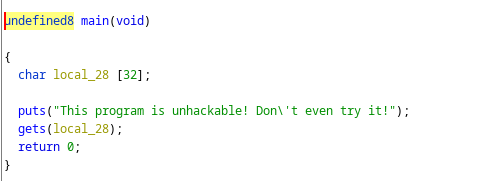
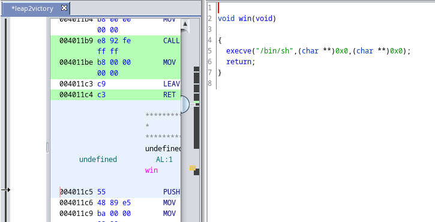
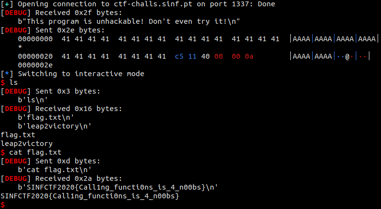
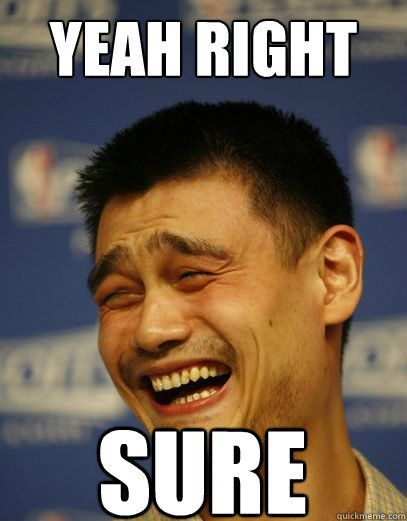

# leap2victory
At the start of the challenge, it is given to us the executable `leap2victory`, but not its source code. So my first thought was to decompile it (yep, I didn't even try to run it first).

I opened the binary in `ghidra` and searched for the `main` function and got the following code snippet:



DON'T EVEN TRY IT? Now I definitely want to try to hack this.

So we know that there's 32 Bytes buffer in the stack and that there's a function `gets` (very insecure) ready to be exploited, with a buffer overflow. Then, the next step is to look to some hidden code that can help us. To find said code and it's address, I looked again into `ghidra` and found an interesting function written right bellow the `main` function:



Interesting, this `win` function, executes a shell. That could be useful to find the flag. As we can see the function starts in address `0x004011c5`. Let's try to run this exploitable code.

Using `python` and `pwntools`, I tried the following script (first locally, then remotely):

```python
from pwn import process, remote


HOST = 'ctf-challs.sinf.pt'
PORT = 1337
#io = process("./leap2victory")
io = remote(HOST, PORT, level='debug')
io.recvuntil("try it!\n")

injection = 'A' * 40 + '\xc5\x11\x40\x00\x00'
io.sendline(injection)
io.interactive()
```

Like I said before, this executable reads from the `STDIN` and stores its value in the the 32 Bytes Buffer. So, We have to inject a string with 40 Bytes (32 for the buffer, 8 for the saved value of `%ebp` in the stack), and then inject the address of `win` (inverted due to the fact that the stack is written in the inverted direction of the memory). This injection of the address overwrites the value of the `return address` of the `main` funtion. When the executable pops its value from the stack, The `Instruction Pointer` will think that the next instruction to execute is the first line of the `win` function, instead of the function that `main` was trying to return to.

Running this script, this is what happens:



I got access to a shell from the server. I ran `ls` to see if the flag was nearby and a found a `flag.txt`. By doing `cat flag.txt`, I was able to get the value of the flag `SINFCTF2020{Call1ng_functi0ns_is_4_n00bs}`.

"This program is unhackable! Don\'t even try it!".
